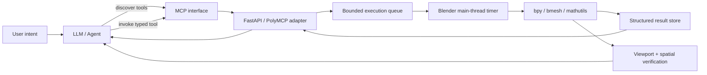
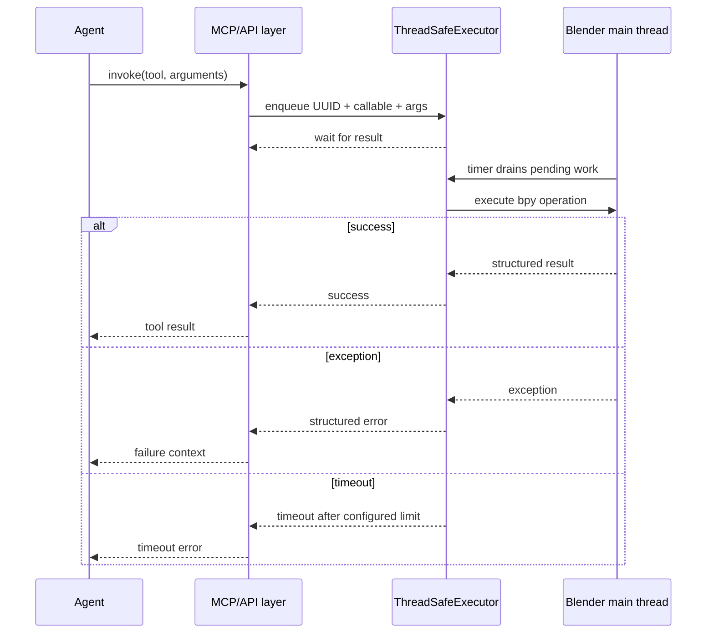

# Blender MCP

> Turn natural-language intent into verifiable Blender operations through an MCP-compatible tool server.

Blender MCP is a Blender add-on that exposes Blender capabilities as agent-callable tools. It is built around a constraint that matters in real 3D automation: Blender data must be mutated safely on Blender's main thread even when requests arrive through an HTTP server.

The server therefore separates **request handling** from **scene execution**. FastAPI/PolyMCP receives tool calls, a bounded queue hands Blender work to a timer-driven main-thread executor, and structured results are returned to the agent. The repository also includes viewport capture, spatial analysis, and operation verification primitives for visual feedback loops.

## Why this project exists

LLMs can plan 3D work, but reliable execution requires more than giving a model arbitrary Python access. A useful agent interface needs:

- discoverable, typed tools instead of unrestricted code execution;
- main-thread-safe access to Blender's `bpy` API;
- structured success and failure responses;
- bounded queues and operation timeouts;
- visual/spatial feedback for checking what actually changed;
- a protocol that can be used by an agent orchestrator rather than a one-off script.

Blender MCP implements that layer.

## Architecture



### Execution model



## Core engineering decisions

### Main-thread-safe Blender execution

`bpy` operations are not treated as arbitrary web-server work. `ThreadSafeExecutor` places operations into a bounded queue and uses `bpy.app.timers` to execute them on Blender's main thread. Each request receives a UUID, result state, timestamp, timeout, and cleanup lifecycle.

### Tool surface, not arbitrary code execution

The add-on exposes purpose-built operations for scene construction and manipulation. The tool surface covers object transforms, materials, animation, cameras, lighting, modifiers, constraints, physics, geometry workflows, import/export, scene utilities, and visual verification.

### Visual feedback loop

The server contains primitives for:

- viewport capture for VLM inspection;
- spatial layout summaries;
- post-operation verification against expected object state;
- camera framing and automatic object arrangement.

This allows an agent workflow to move from **act** to **observe** to **verify**, rather than assuming a successful function return means the scene is correct.

## Protocol

The repository supports an MCP-oriented agent flow and also exposes HTTP endpoints for direct inspection.

### Tool discovery

```text
GET /mcp/list_tools
```

The client receives the available tool definitions and their argument schemas.

### Tool invocation

```text
POST /mcp/invoke/{tool_name}
Content-Type: application/json

{
  "arguments": {
    "...": "tool-specific arguments"
  }
}
```

Conceptually, every invocation follows this lifecycle:

```text
request -> validate arguments -> enqueue -> execute on Blender main thread
        -> serialize result/error -> return to agent
```

The HTTP adapter is intentionally separated from Blender execution semantics. Agents can reason concurrently; Blender scene mutation remains serialized and safe.

## Representative capabilities

| Area | Examples |
|---|---|
| Scene construction | create and transform objects, collections, text and curves |
| Materials | create materials, configure shaders and assign slots |
| Animation | keyframes, timelines and object animation |
| Camera & lighting | create cameras/lights, frame scenes and configure views |
| Physics | particles and simulation-oriented operations |
| Geometry | modifiers, constraints and procedural workflows |
| Files | import/export and scene operations |
| Agent feedback | viewport capture, spatial analysis and result verification |

## Agent example

```python
import asyncio
from polymcp.polyagent import UnifiedPolyAgent, OllamaProvider

async def main():
    agent = UnifiedPolyAgent(
        llm_provider=OllamaProvider(
            model="gpt-oss:120b-cloud",
            temperature=0.1,
        ),
        mcp_servers=["http://localhost:8000/mcp"],
        verbose=True,
    )

    async with agent:
        result = await agent.run_async(
            "Create a metallic cube, light it with a three-point setup, "
            "frame it with a camera, then verify the final scene.",
            max_steps=8,
        )
        print(result)

asyncio.run(main())
```

## Example agent trace

The exact tool names depend on the exposed registry, but a successful run should look structurally like this:

```text
USER
Create a metallic cube, add a camera and three-point lighting, then verify it.

AGENT
1. Inspect available scene and creation tools.
2. Create the mesh.
3. Create and assign a metallic material.
4. Add key, fill and rim lights.
5. Position a camera to frame the scene.
6. Capture/inspect the viewport.
7. Verify expected object state.

TOOL RESULT
{ "status": "success", "object": "Cube", ... }

TOOL RESULT
{ "status": "success", "material": "Metal", ... }

VERIFICATION
{
  "success": true,
  "issues": [],
  "spatial_context": { ... },
  "viewport": { ... }
}
```

See [`docs/AGENT_TRACE.md`](docs/AGENT_TRACE.md) for a trace template that can be replaced with a captured real run.

## Failure and retry behavior

Failures are first-class outputs. The execution layer records the function, bounded argument context, traceback, timestamp, and error state. A higher-level agent can use that information to repair arguments or choose a different tool.

Example:

```text
Attempt 1: assign material to "ProductCube"
Result: object not found

Agent recovery:
- inspect scene objects
- identify actual object name "Cube"
- retry material assignment with corrected target

Attempt 2: success
```

The server itself does not hide failures behind infinite retries. Retry policy belongs to the orchestrating agent, where step limits and recovery strategies can be controlled explicitly.

## Installation

### Requirements

- Blender 3.0+
- Python packages used by the add-on: FastAPI, Uvicorn, Pydantic, docstring-parser and NumPy
- PolyMCP when using the MCP agent integration

### Install the add-on

1. Download `blender_mcp.py`.
2. Open Blender.
3. Go to **Edit -> Preferences -> Add-ons**.
4. Choose **Install from Disk...**.
5. Select `blender_mcp.py` and enable the add-on.
6. Press **N** in the 3D Viewport and open the **MCP Server** panel.
7. Start the server.

By default the service runs on `http://localhost:8000`.

> The current implementation can install missing Python dependencies from Blender's Python environment. For controlled environments, pre-install and pin dependencies instead of relying on runtime installation.

## Configuration

```python
class Config:
    HOST = "0.0.0.0"
    PORT = 8000
    QUEUE_TIMEOUT = 30.0
    QUEUE_CHECK_INTERVAL = 0.01
    MAX_QUEUE_SIZE = 1000
    THREAD_SAFE_OPERATIONS = True
    AUTO_INSTALL_PACKAGES = True
    ENABLE_CACHING = True
    CACHE_SIZE = 256
```

## Validation and benchmarks

This repository includes evidence-oriented tooling rather than hard-coded performance claims.

### Static tests

```bash
python -m unittest discover -s tests -v
```

The initial suite verifies important source-level invariants without requiring Blender in CI: bounded queue configuration, UUID request IDs, timeout handling, timer-based main-thread processing, error capture, and result cleanup.

### Concurrent request benchmark

Run Blender with the server enabled, then execute:

```bash
python benchmarks/concurrent_requests.py \
  --url http://localhost:8000 \
  --endpoint /mcp/list_tools \
  --requests 100 \
  --concurrency 10
```

The benchmark reports success/failure counts, throughput, and p50/p95/p99 latency. Commit measured results only after running them on a named machine and Blender version; the repository intentionally does not invent benchmark numbers.

See [`benchmarks/README.md`](benchmarks/README.md).

## Demo evidence

The strongest demo for this project is a single uninterrupted recording showing:

```text
natural-language request
    -> agent tool discovery
    -> visible tool calls
    -> Blender scene changing
    -> verification result
    -> final viewport
```

Place the recording at `docs/assets/blender-mcp-demo.gif` and the README will become a direct proof artifact rather than only a technical description.

## CI

GitHub Actions runs source-level tests and Python syntax checks on every push and pull request. Blender-dependent integration tests remain a separate local validation stage because standard hosted runners do not provide the interactive Blender runtime used by the add-on.

## Current limitations

- Blender operations are serialized by design; concurrency improves request handling, not simultaneous scene mutation.
- Some Blender APIs differ across major versions and require compatibility testing.
- Runtime dependency installation is convenient for demos but should be replaced by pinned environment provisioning for controlled deployments.
- Visual verification primitives exist, but end-to-end VLM judging depends on the chosen agent/orchestrator.
- Authentication is not the focus of the current local server and should be added before exposing the service outside a trusted network.

## Roadmap

- [ ] Record and embed the end-to-end demo GIF/video
- [ ] Capture a real agent trace from a multi-step scene task
- [ ] Add Blender-runtime integration tests for representative tools
- [ ] Publish benchmark results with hardware and Blender version metadata
- [ ] Add authentication for non-local deployments
- [ ] Add versioned tool schemas and compatibility matrix
- [ ] Add structured tracing/OpenTelemetry integration

## Repository structure

```text
.
├── blender_mcp.py
├── tests/
│   └── test_source_invariants.py
├── benchmarks/
│   ├── README.md
│   └── concurrent_requests.py
├── docs/
│   └── AGENT_TRACE.md
└── .github/workflows/ci.yml
```

## Engineering summary

Blender MCP is not a chat wrapper around Blender. It is an agent execution boundary: typed tools on one side, Blender's stateful main-thread runtime on the other, with queueing, timeouts, structured failures, and visual verification connecting them.

## License

Add a license before external distribution or reuse.